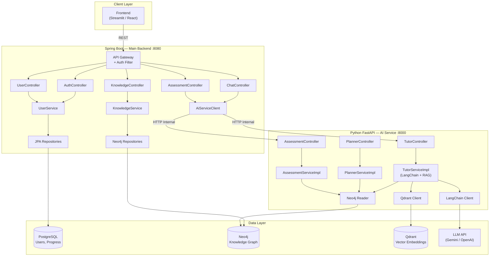
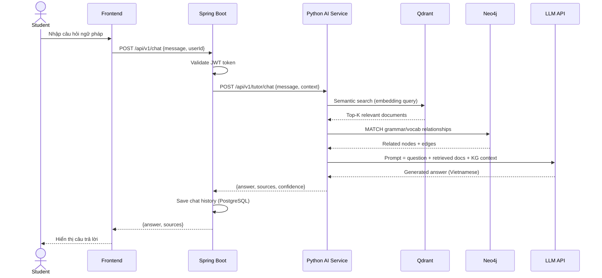
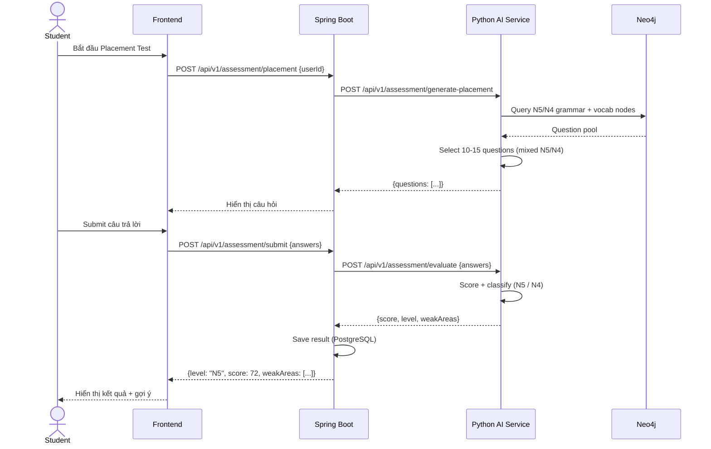
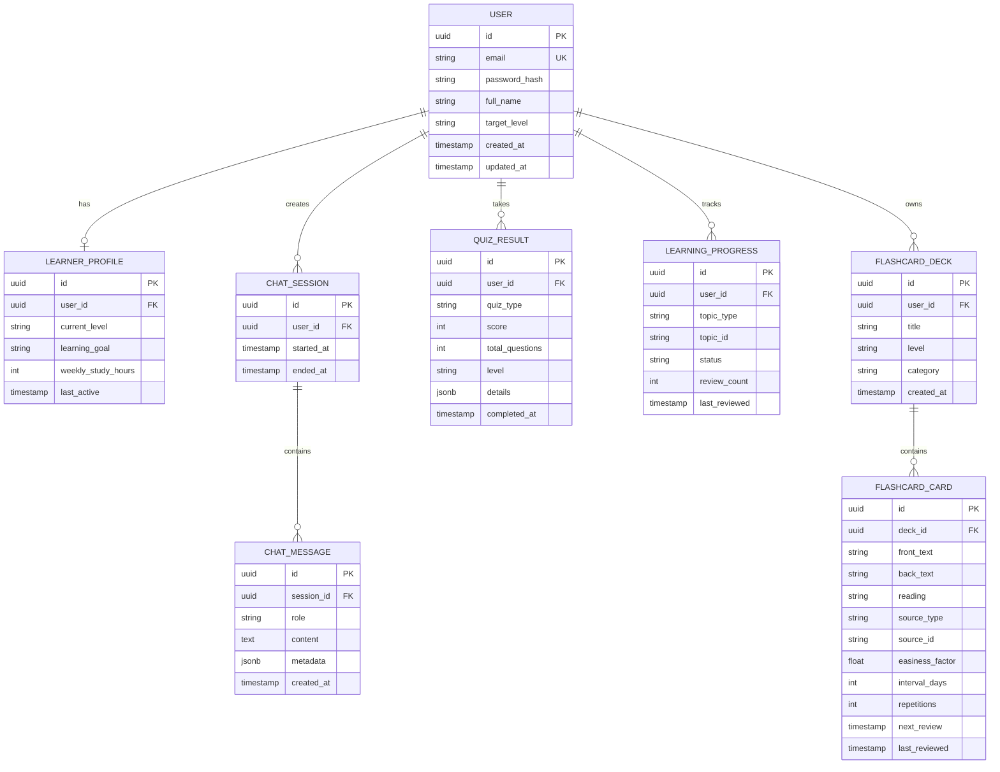
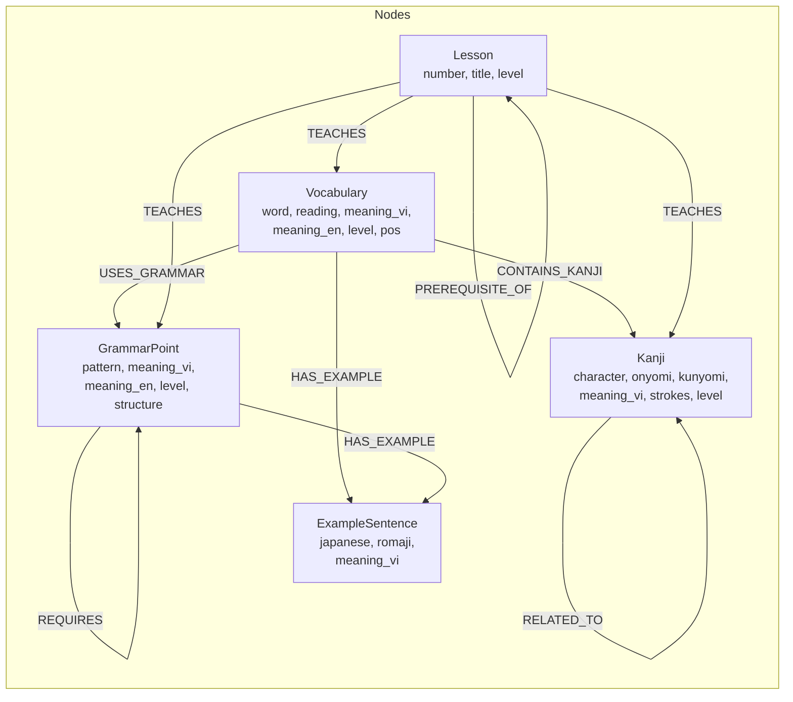
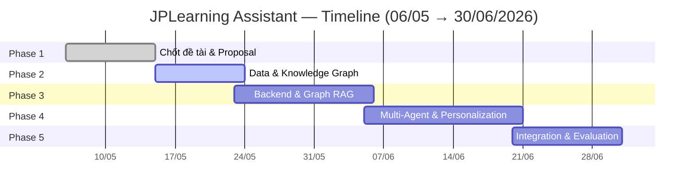

# Software Requirements Specification (SRS)
## JPLearning Assistant — Web-Based Virtual Assistant for Japanese Language Learning

| Field | Value |
|---|---|
| **Version** | 1.0 |
| **Date** | 2026-05-14 |
| **Author** | Bui Duy Hieu |
| **Supervisor** | Dr. Nguyen Duy Nghiem |
| **Architecture** | Hybrid (Spring Boot + Python AI Service) |

---

## 1. Giới thiệu

### 1.1. Mục đích
Tài liệu này mô tả yêu cầu phần mềm cho hệ thống JPLearning Assistant — trợ lý ảo hỗ trợ sinh viên Việt Nam học tiếng Nhật trình độ JLPT N5/N4.

### 1.2. Phạm vi
- Hệ thống web-based, prototype cho mục đích nghiên cứu.
- Backend: Java Spring Boot (main) + Python FastAPI (AI service).
- Hỗ trợ grammar, vocabulary, kanji — giải thích bằng Tiếng Việt.

### 1.3. Đối tượng sử dụng
| Actor | Mô tả |
|---|---|
| **Student** | Sinh viên Việt Nam học tiếng Nhật trình độ sơ cấp (N5/N4) |
| **Admin** | Quản trị viên quản lý KG, question bank, flashcard templates, xem thống kê |

### 1.4. Thuật ngữ
| Thuật ngữ | Giải thích |
|---|---|
| KG | Knowledge Graph — đồ thị tri thức lưu trữ quan hệ giữa các khái niệm |
| RAG | Retrieval-Augmented Generation — truy xuất trước khi sinh response |
| JLPT | Japanese Language Proficiency Test |
| LLM | Large Language Model |

---

## 2. Yêu cầu Chức năng (Functional Requirements)

### 2.1. User Management (Spring Boot)

| ID | Requirement | Priority |
|---|---|---|
| FR-01 | Đăng ký tài khoản (email/password) | Must |
| FR-02 | Đăng nhập / Đăng xuất | Must |
| FR-03 | Tạo/cập nhật learner profile (tên, trình độ, mục tiêu JLPT) | Must |
| FR-04 | Xem learning progress dashboard | Should |

### 2.2. Knowledge Graph (Spring Boot + Neo4j)

| ID | Requirement | Priority |
|---|---|---|
| FR-05 | Tra cứu từ vựng N5/N4 (search by romaji, kanji, meaning) | Must |
| FR-06 | Tra cứu ngữ pháp N5/N4 (search by pattern, meaning) | Must |
| FR-07 | Tra cứu kanji N5/N4 (search by kanji, reading, meaning) | Must |
| FR-08 | Xem relationships giữa vocab ↔ grammar ↔ kanji | Should |
| FR-09 | Admin: CRUD vocabulary, grammar, kanji nodes | Could |

### 2.3. Tutor Module — AI Chatbot (Python AI Service)

| ID | Requirement | Priority |
|---|---|---|
| FR-10 | Hỏi đáp ngữ pháp tiếng Nhật bằng tiếng Việt | Must |
| FR-11 | Giải thích nghĩa từ vựng với ví dụ câu | Must |
| FR-12 | So sánh 2 mẫu ngữ pháp tương tự | Should |
| FR-13 | Hệ thống trả lời dựa trên RAG (truy xuất KG + Vector DB trước) | Must |
| FR-14 | Lưu lịch sử chat | Should |

### 2.4. Planner Module (Python AI Service)

| ID | Requirement | Priority |
|---|---|---|
| FR-15 | Sinh study plan dựa trên trình độ + mục tiêu + thời gian | Should |
| FR-16 | Gợi ý bài học tiếp theo dựa trên progress | Should |
| FR-17 | Hiển thị learning roadmap | Could |

### 2.5. Assessment Module (Python AI Service)

| ID | Requirement | Priority |
|---|---|---|
| FR-18 | Placement test: xác định trình độ ban đầu (N5 hay N4) | Must |
| FR-19 | Quiz ngữ pháp / từ vựng (multiple choice) | Must |
| FR-20 | Theo dõi điểm quiz qua thời gian | Should |
| FR-21 | Adaptive difficulty (đúng → khó hơn, sai → dễ hơn) | Could |

### 2.6. Flashcard Module — Spaced Repetition (Spring Boot)

| ID | Requirement | Priority |
|---|---|---|
| FR-22 | Tạo deck flashcard theo chủ đề (N5 Vocab, N4 Grammar, Kanji...) | Must |
| FR-23 | Học flashcard: hiển thị mặt trước (JP) → lật xem mặt sau (VI + romaji) | Must |
| FR-24 | Tự đánh giá: Again / Hard / Good / Easy (thuật toán SM-2) | Must |
| FR-25 | Spaced Repetition scheduling — tự động lên lịch ôn theo SM-2 | Must |
| FR-26 | Xem thống kê: cards learned / due today / streak | Should |
| FR-27 | Auto-generate flashcards từ Knowledge Graph | Should |
| FR-28 | Shuffle / filter cards theo level (N5/N4) | Should |

### 2.7. Admin Management (Spring Boot)

| ID | Requirement | Priority |
|---|---|---|
| FR-29 | Admin CRUD question bank (câu hỏi quiz: nhiều lựa chọn, điền từ, sắp xếp) | Must |
| FR-30 | Admin CRUD flashcard templates (bộ flashcard mẫu cho student) | Must |
| FR-31 | Admin import question/flashcard từ CSV/Excel | Should |
| FR-32 | Dashboard thống kê: tổng users, active users, quiz completion rate | Must |
| FR-33 | Thống kê flashcard: avg retention rate, most failed cards | Should |
| FR-34 | Thống kê chatbot: tổng sessions, avg messages/session, popular topics | Should |
| FR-35 | Quản lý users: xem danh sách, vô hiệu hóa tài khoản | Should |
| FR-36 | Admin CRUD Knowledge Graph nodes (vocab, grammar, kanji) | Must |
| FR-37 | Export báo cáo thống kê (CSV) | Could |

---

## 3. Yêu cầu Phi chức năng (Non-Functional Requirements)

| ID | Category | Requirement |
|---|---|---|
| NFR-01 | Performance | API response time < 2s (non-AI), < 10s (AI/LLM) |
| NFR-02 | Availability | System uptime > 95% trong thời gian demo |
| NFR-03 | Security | Passwords hashed (BCrypt), JWT authentication |
| NFR-04 | Scalability | Hỗ trợ 50 concurrent users (prototype scope) |
| NFR-05 | Maintainability | Code coverage > 60%, Javadoc/Docstrings cho public APIs |
| NFR-06 | Usability | UI responsive, giải thích bằng Tiếng Việt |
| NFR-07 | Data | Chỉ chứa data JLPT N5/N4 |
| NFR-08 | UI/UX | Chatbot dạng **floating bar** (kiểu roadmap.sh AI Tutor) — luôn hiển thị khi user duyệt content |

---

## 3.1. UI Reference: roadmap.sh AI Tutor

**Reference:** [https://roadmap.sh/computer-science](https://roadmap.sh/computer-science)

Chatbot của dự án sẽ lấy cảm hứng từ **AI Tutor** của roadmap.sh:

| Feature | roadmap.sh | JPLearning (adapt) |
|---|---|---|
| **Floating chat bar** | Thanh gõ câu hỏi cố định ở dưới màn hình | Tương tự — "AI Tutor · Hỏi gì đó về tiếng Nhật..." |
| **Contextual suggestions** | Gợi ý câu hỏi theo node đang xem | Gợi ý theo bài học/grammar đang xem |
| **Expand to modal** | Click mở rộng thành chat panel | Tương tự — expand lên panel bên phải |
| **Topic chips** | Hiển thị chips chủ đề gợi ý (Scaling, Recursion...) | Chips: "Động từ thể て", "Trợ từ は vs が", "Kanji N5"... |
| **Login required** | Cần đăng nhập để chat | Tương tự |
| **Roadmap integration** | Chat gắn với learning path | Chat gắn với KG nodes + study plan |

---

## 4. Diagrams

### 4.1. Use Case Diagram

```mermaid
graph TB
    subgraph System["JPLearning Assistant"]
        UC1["UC01: Đăng ký / Đăng nhập"]
        UC2["UC02: Quản lý Profile"]
        UC3["UC03: Tra cứu Từ vựng"]
        UC4["UC04: Tra cứu Ngữ pháp"]
        UC5["UC05: Tra cứu Kanji"]
        UC6["UC06: Chat với Tutor AI"]
        UC7["UC07: Làm Placement Test"]
        UC8["UC08: Làm Quiz"]
        UC9["UC09: Xem Study Plan"]
        UC10["UC10: Xem Progress Dashboard"]
        UC11["UC11: Quản lý KG Content"]
        UC12["UC12: Học Flashcard (SRS)"]
        UC13["UC13: Quản lý Question Bank"]
        UC14["UC14: Quản lý Flashcard Templates"]
        UC15["UC15: Xem Dashboard Thống kê"]
        UC16["UC16: Quản lý Users"]
    end

    Student(("👤 Student"))
    Admin(("🔧 Admin"))

    Student --> UC1
    Student --> UC2
    Student --> UC3
    Student --> UC4
    Student --> UC5
    Student --> UC6
    Student --> UC7
    Student --> UC8
    Student --> UC9
    Student --> UC10
    Student --> UC12

    Admin --> UC1
    Admin --> UC11
    Admin --> UC13
    Admin --> UC14
    Admin --> UC15
    Admin --> UC16
```

### 4.2. System Architecture Diagram

### 4.3. Sequence Diagram — Chat với Tutor

### 4.4. Sequence Diagram — Placement Test

### 4.5. ERD — PostgreSQL

### 4.6. Knowledge Graph Schema — Neo4j

---

## 5. Use Case Specifications

### UC06: Chat với Tutor AI (Primary Use Case)

| Field | Detail |
|---|---|
| **Actor** | Student |
| **Precondition** | Student đã đăng nhập |
| **Main Flow** | 1. Student đang duyệt nội dung (từ vựng/ngữ pháp/roadmap) 2. Student click vào **floating chat bar** ở dưới màn hình 3. Chat panel expand lên (kiểu roadmap.sh AI Tutor) 4. System hiển thị **topic chips** gợi ý theo context đang xem 5. Student nhập câu hỏi hoặc chọn chip 6. System truy xuất context từ KG + Vector DB (RAG) 7. System gọi LLM với prompt + context 8. System trả lời bằng tiếng Việt kèm ví dụ 9. System lưu chat history |
| **Alt Flow** | 6a. Không tìm thấy context → trả lời bằng LLM thuần + cảnh báo |
| **Postcondition** | Chat message được lưu, progress có thể được cập nhật |

### UC07: Làm Placement Test

| Field | Detail |
|---|---|
| **Actor** | Student |
| **Precondition** | Student đã đăng nhập, chưa có placement result |
| **Main Flow** | 1. Student chọn "Làm bài kiểm tra trình độ" 2. System sinh 10-15 câu hỏi mix N5/N4 từ KG 3. Student trả lời từng câu 4. System chấm điểm + phân loại trình độ 5. System lưu kết quả + cập nhật profile |
| **Postcondition** | Learner profile cập nhật current_level |

### UC08: Làm Quiz

| Field | Detail |
|---|---|
| **Actor** | Student |
| **Precondition** | Student đã đăng nhập |
| **Main Flow** | 1. Student chọn chủ đề (grammar/vocab/kanji) + level 2. System sinh quiz từ KG 3. Student trả lời 4. System chấm điểm + giải thích đáp án 5. System cập nhật learning progress |
| **Postcondition** | Quiz result được lưu, progress được cập nhật |

### UC12: Học Flashcard (SRS)

| Field | Detail |
|---|---|
| **Actor** | Student |
| **Precondition** | Student đã đăng nhập, có ít nhất 1 deck |
| **Main Flow** | 1. Student chọn deck hoặc "Review due cards" 2. System hiển thị mặt trước (kanji/grammar pattern) 3. Student suy nghĩ → bấm "Lật" 4. System hiển thị mặt sau (nghĩa tiếng Việt + romaji + ví dụ) 5. Student tự đánh giá: Again / Hard / Good / Easy 6. System tính toán SM-2 → cập nhật next_review |
| **Alt Flow** | 1a. Chưa có deck → System gợi ý auto-generate từ KG theo level |
| **Postcondition** | Card intervals cập nhật, progress tracking ghi nhận |

> **SM-2 Algorithm:** easiness_factor, interval, repetitions được tính lại sau mỗi review. Card đánh giá "Again" reset về interval=1. Card "Easy" tăng interval nhanh.

### UC13: Quản lý Question Bank

| Field | Detail |
|---|---|
| **Actor** | Admin |
| **Precondition** | Admin đã đăng nhập với role ADMIN |
| **Main Flow** | 1. Admin vào trang Question Bank 2. Xem danh sách câu hỏi (filter theo level, category, type) 3. Tạo/sửa/xóa câu hỏi (nhiều lựa chọn, điền từ, sắp xếp) 4. Assign câu hỏi vào quiz category |
| **Alt Flow** | 3a. Import hàng loạt từ CSV/Excel |
| **Postcondition** | Question bank được cập nhật, quiz system dùng data mới |

### UC15: Xem Dashboard Thống kê

| Field | Detail |
|---|---|
| **Actor** | Admin |
| **Precondition** | Admin đã đăng nhập |
| **Main Flow** | 1. Admin vào Dashboard 2. Xem tổng quan: total users, active users (7d/30d), new registrations 3. Xem quiz stats: completion rate, avg score theo level 4. Xem flashcard stats: retention rate, most failed cards 5. Xem chatbot stats: total sessions, popular topics 6. Filter theo khoảng thời gian |
| **Alt Flow** | 6a. Export báo cáo CSV |
| **Postcondition** | Không thay đổi data |

---

## 6. API Endpoints (Draft)

### Spring Boot — Public API

| Method | Endpoint | Mô tả |
|---|---|---|
| POST | `/api/v1/auth/register` | Đăng ký |
| POST | `/api/v1/auth/login` | Đăng nhập → JWT |
| GET | `/api/v1/users/me` | Lấy profile |
| PUT | `/api/v1/users/me` | Cập nhật profile |
| GET | `/api/v1/knowledge/vocabulary?q=...&level=N5` | Tra từ vựng |
| GET | `/api/v1/knowledge/grammar?q=...&level=N5` | Tra ngữ pháp |
| GET | `/api/v1/knowledge/kanji?q=...&level=N5` | Tra kanji |
| POST | `/api/v1/chat` | Chat với Tutor AI |
| GET | `/api/v1/chat/history` | Lịch sử chat |
| POST | `/api/v1/assessment/placement` | Bắt đầu placement test |
| POST | `/api/v1/assessment/submit` | Submit quiz answers |
| GET | `/api/v1/progress` | Xem learning progress |
| GET | `/api/v1/flashcards/decks` | List decks |
| POST | `/api/v1/flashcards/decks` | Tạo deck (hoặc auto-generate từ KG) |
| GET | `/api/v1/flashcards/decks/{id}/cards` | Lấy cards trong deck |
| GET | `/api/v1/flashcards/review/due` | Lấy cards cần review hôm nay |
| POST | `/api/v1/flashcards/review` | Submit review result (SM-2 update) |
| GET | `/api/v1/flashcards/stats` | Thống kê flashcard |

### Spring Boot — Admin API (role ADMIN required)

| Method | Endpoint | Mô tả |
|---|---|---|
| GET | `/api/v1/admin/questions` | List question bank (filter, paginate) |
| POST | `/api/v1/admin/questions` | Tạo câu hỏi mới |
| PUT | `/api/v1/admin/questions/{id}` | Cập nhật câu hỏi |
| DELETE | `/api/v1/admin/questions/{id}` | Xóa câu hỏi |
| POST | `/api/v1/admin/questions/import` | Import CSV/Excel |
| GET | `/api/v1/admin/flashcard-templates` | List flashcard templates |
| POST | `/api/v1/admin/flashcard-templates` | Tạo template |
| PUT | `/api/v1/admin/flashcard-templates/{id}` | Cập nhật template |
| DELETE | `/api/v1/admin/flashcard-templates/{id}` | Xóa template |
| GET | `/api/v1/admin/stats/overview` | Dashboard overview (users, activity) |
| GET | `/api/v1/admin/stats/quiz` | Quiz statistics |
| GET | `/api/v1/admin/stats/flashcard` | Flashcard statistics |
| GET | `/api/v1/admin/stats/chatbot` | Chatbot statistics |
| GET | `/api/v1/admin/stats/export?type=csv` | Export báo cáo |
| GET | `/api/v1/admin/users` | List users |
| PUT | `/api/v1/admin/users/{id}/status` | Enable/disable user |
| POST | `/api/v1/admin/knowledge/vocabulary` | CRUD vocab nodes |
| POST | `/api/v1/admin/knowledge/grammar` | CRUD grammar nodes |
| POST | `/api/v1/admin/knowledge/kanji` | CRUD kanji nodes |

### Python AI — Internal API (chỉ Spring Boot gọi)

| Method | Endpoint | Mô tả |
|---|---|---|
| POST | `/api/v1/tutor/chat` | RAG-based Q&A |
| POST | `/api/v1/planner/recommend` | Gợi ý study plan |
| POST | `/api/v1/assessment/generate` | Sinh câu hỏi quiz |
| POST | `/api/v1/assessment/evaluate` | Chấm điểm + phân tích |

---

## 7. Timeline Thực tế (theo Kế hoạch GVHD)

| Phase | Thời gian | Ngày | Nội dung |
|---|---|---|---|
| **Phase 1** — Chốt đề tài & Proposal | 06/05 → 14/05 | 9 ngày | Chốt đề tài, hoàn thiện proposal (research questions, scope, evaluation criteria, baseline comparison), xác nhận kiến trúc + tech stack + dataset |
| **Phase 2** — Data & Knowledge Graph | 15/05 → 23/05 | 9 ngày | Thu thập dữ liệu JLPT N5, chuẩn hóa vocab/grammar/kanji/examples, thiết kế Neo4j schema, xây dựng relationships, kiểm tra truy vấn |
| **Phase 3** — Backend & Graph RAG | 23/05 → 05/06 | 14 ngày | REST API (Spring Boot), PostgreSQL + Neo4j integration, Qdrant vector DB, Graph RAG pipeline, kiểm tra retrieval quality |
| **Phase 4** — Multi-Agent & Personalization | 05/06 → 20/06 | 16 ngày | Tutor Agent (Q&A grammar/vocab), Planner Agent (learning roadmap), Assessor Agent (placement test + progress), memory module, agent workflow testing |
| **Phase 5** — Integration & Evaluation | 20/06 → 30/06 | 11 ngày | Tích hợp toàn bộ, deploy cloud/server, system testing, đánh giá retrieval accuracy + response quality + personalization, phân tích hallucination + consistency |

### ✅ Phase 1 Status: DONE (đã chốt)
- Đề tài, proposal v5, kiến trúc Hybrid (Spring Boot + Python AI), SRS document.

### 🔄 Phase 2 Status: IN PROGRESS
- Đang thu thập dữ liệu, thiết kế KG schema.

---

## 8. Constraints & Assumptions

### Constraints
- Timeline: **85 ngày** (15/05 → 08/08/2026). Phần mềm hoàn thành trước 30/06.
- Data: Chỉ JLPT N5/N4.
- LLM: Dùng API service (Gemini/OpenAI), không self-host.
- Frontend: Streamlit/Gradio cho prototype, có thể nâng cấp React sau.

### Assumptions
- Sinh viên có internet ổn định.
- LLM API available và response < 10s.
- Neo4j Community Edition đủ cho prototype.
- Datasets hiện tại đủ phong phú cho N5/N4.
